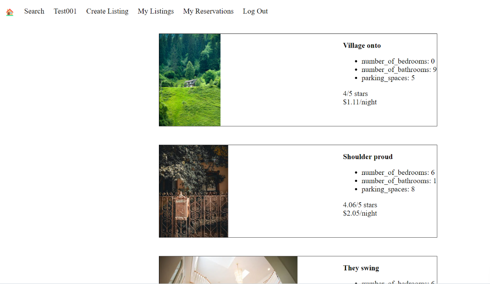

# LightBnB

LightBnB is a full-stack web application that allows homeowners to rent out their homes to vacationers, creating an alternative to hotels and bed and breakfasts. Users can browse properties, book reservations, view their bookings, and leave reviews. This project integrates a PostgreSQL database with a Node.js backend and a dynamic front-end to deliver a seamless user experience.

### About LightBnB

LightBnB is an innovative app that bridges the gap between vacationers and homeowners. Users can explore properties, filter by city and price range, book reservations, and leave reviews. This app showcases modern web development techniques and relational database integration.

## Installation and Setup

1. Clone the repository:

```bash
git clone git@github.com:ArcaneCipher/LightBnB.git
```

2. Navigate to the project directory:

```bash
cd LightBnB
```

3. Install dependencies:

```bash
npm install
```

4. Navigate to the WebApp directory:

```bash
cd LightBnB_WebApp
```

5. Install WebApp dependencies:

```bash
npm install
```

*Make sure to install all dependencies by running npm install in each respective directory (`LightBnB` and `LightBnB_WebApp`).

6. Set up the database:

```bash
psql -U your-username -d postgres
CREATE DATABASE lightbnb;
\i migrations/01_schema.sql
\i seeds/01_seeds.sql
```

7. Start the application (from WebApp directory):

```bash
npm run local
```

8. Open the application in your browser:

```arduino
http://localhost:3000
```

## Functional Requirements

### Database Setup

- **ERD Design:** Create an entity relationship diagram (ERD) to map the database structure.
- **Database Schema:** Define tables, relationships, and constraints in migrations/01_schema.sql.
- **Seed Data:** Populate the database with test data using seeds/01_seeds.sql.

### Core Features

- **User Management:**
  - Validate user login.
  - Create new users in the database.
- **Property Listings:**
  - Query properties by city, price range, and availability.
  - Add new property listings.
- **Reservations:**
  - View a user’s reservations.
  - Book new reservations for properties.
- **Reviews:**
  - Allow users to leave reviews for properties they’ve reserved.

### Code Structure

- **Back-End Logic:**
  - Centralized query management in db/index.js.
  - Modular database interaction functions in db/database.js.
- **Front-End Components:**
  - Dynamic components built with jQuery in public/javascript/components.
  - Single-page application (SPA) functionality with views_manager.js.
- **API Routes:**
  - RESTful routes for user and property data in routes/.

## Dependencies

The LightBnB project uses the following dependencies:

### LightBnB (Main)

- `body-parser`: "^1.15.2" - Middleware for parsing incoming request bodies.
- `chance`: "^1.0.2" - Utility for generating random data (e.g., strings, numbers).
- `express`: "^4.13.4" - Web framework for handling HTTP requests and routing.
- `md5`: "^2.1.0" - Utility for hashing data using the MD5 algorithm.

### LightBnB_WebApp

- `bcrypt`: "^5.1.1" - Library for hashing and verifying passwords securely.
- `bcryptjs`: "^2.4.3" - JavaScript implementation of bcrypt for password hashing.
- `cookie-session`: "^1.3.3" - Middleware for managing session data using cookies.
- `express`: "^4.17.1" - Web framework for handling HTTP requests and routing.
- `nodemon`: "^1.19.1" - Development tool for automatically restarting the server on file changes.
- `pg`: "^8.13.1" - PostgreSQL client for querying the database.

## Technical Details

### Frontend

The frontend of LightBnB is a Single Page Application (SPA) designed to provide a dynamic and seamless user experience. It is built using the following technologies and approaches:

- HTML5: Structuring the web application with semantic and accessible elements.
- CSS (SASS): Styling the application with maintainable and modular stylesheets, leveraging SASS for advanced features like variables and nesting.
- JavaScript (ES6): Enabling interactivity and dynamic content updates on the client side.
- jQuery: Simplifying DOM manipulation, event handling, and AJAX requests.
- AJAX: Handling asynchronous data fetching and updating the UI without reloading the page.

#### Frontend Features:

- Dynamic Components: Modular, reusable components (e.g., property listings, forms) created with jQuery.
- Responsive Design: Ensures compatibility with various screen sizes and devices.
- Views Manager: Manages which UI components are displayed dynamically based on user actions.
- CSS Preprocessing: SASS is used to structure and simplify styles.

### Backend

The backend of LightBnB is built on Node.js and Express.js, providing a robust and scalable server-side architecture to manage application logic and database interactions.

- Node.js: Executes JavaScript code on the server and handles asynchronous operations.
- Express.js: Simplifies routing and middleware integration for handling HTTP requests and responses.
- PostgreSQL: Relational database for storing and managing application data.
- pg (node-postgres): Library for querying the PostgreSQL database using asynchronous promise-based functions.
- Cookie-Session: Manages user sessions and authentication with cookies.

#### Backend Features:

- RESTful API:
  - Routes handle CRUD operations for users, properties, reservations, and reviews.
  - Data is fetched dynamically based on user actions and filtered parameters.
- Database Integration:
  - A relational database schema ensures consistent and optimized data storage.
  - Secure handling of sensitive data like passwords using bcrypt.
- Middleware:
  - body-parser for parsing HTTP request bodies.
  - cookie-session for session management and user authentication.
- Asynchronous Queries:
  - Efficiently fetch, insert, and update data using promise-based queries.

#### Backend Highlights:

- Query logic centralized in the db/index.js and db/database.js files for maintainability.
- Routes structured in routes/ directory for modular handling of user and API requests.
- Integration of logging and error handling to improve debugging and stability.

## Screenshots

